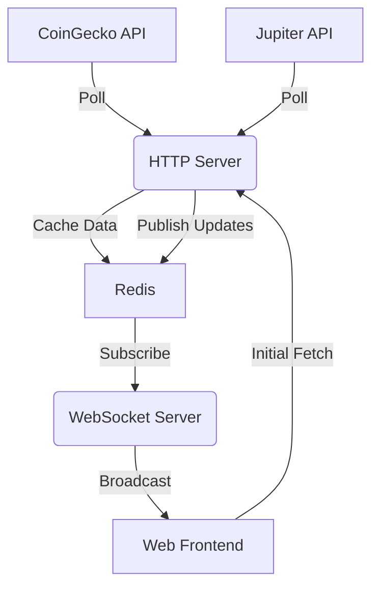

# SolStream 🌊
## live here http://solstream.duckdns.org/](http://solstream.giize.com or use the public ip http://51.21.245.73/
**SolStream** is a real-time token discovery engine for the Solana ecosystem. It aggregates trending token data from **Jupiter** (for execution prices and liquidity) and **CoinGecko** (for historical context) to provide a unified, live view of market movers.

## 🚀 Key Features

*   **🔥 Live Trending Data**: Aggregates "Top Trending" lists from CoinGecko and merges them with real-time execution data from Jupiter.
*   **⚡ Real-Time Updates**: Instant price, volume, and market cap updates via WebSockets—no page refreshes required.
*   **🔍 Smart Filtering & Sorting**: Dynamically filter by timeframe (1h, 6h, 24h, 7d) and sort by Volume, Price Change, or Market Cap.
*   **🏗️ Microservices Architecture**:
    *   **HTTP Server**: Polls external APIs, normalizes data, and caches it in Redis.
    *   **WebSocket Server**: Subscribes to Redis updates and broadcasts them to connected clients.
    *   **Web Client**: A modern, responsive Next.js frontend with client-side sorting and real-time state management.

## 🛠️ Tech Stack

*   **Frontend**: Next.js, React, Tailwind CSS
*   **Backend**: Node.js, Express, WebSocket (`ws`)
*   **Data & Caching**: Redis (Pub/Sub)
*   **Monorepo Tools**: Turborepo, pnpm

## 📦 Architecture



## 🏁 Getting Started

### Prerequisites

*   Node.js (v18+)
*   pnpm
*   Redis (running locally on port 6379)

### Installation

1.  **Clone the repository:**
    ```bash
    git clone https://github.com/HarshAgarwal-IITD/UnifiedCryptoMonitor.git
    cd UnifiedCryptoMonitor
    ```

2.  **Install dependencies:**
    ```bash
    pnpm install
    ```

3.  **Environment Setup:**
    Ensure you have a `.env` file in `apps/http-server`, `apps/ws-server`, and `apps/web` with the necessary API keys and URLs (see `.env.example` in respective directories if available).

4.  **Start the development server:**
    ```bash
    pnpm run dev
    ```

    This command starts the HTTP server, WebSocket server, and Web frontend concurrently.

### Usage

*   Open [http://localhost:3000](http://localhost:3000) to view the dashboard.
*   Use the filter bar to sort tokens by volume, price change, or market cap.
*   Watch as data updates in real-time!

## 🤝 Contributing

Contributions are welcome! Please feel free to submit a Pull Request.
